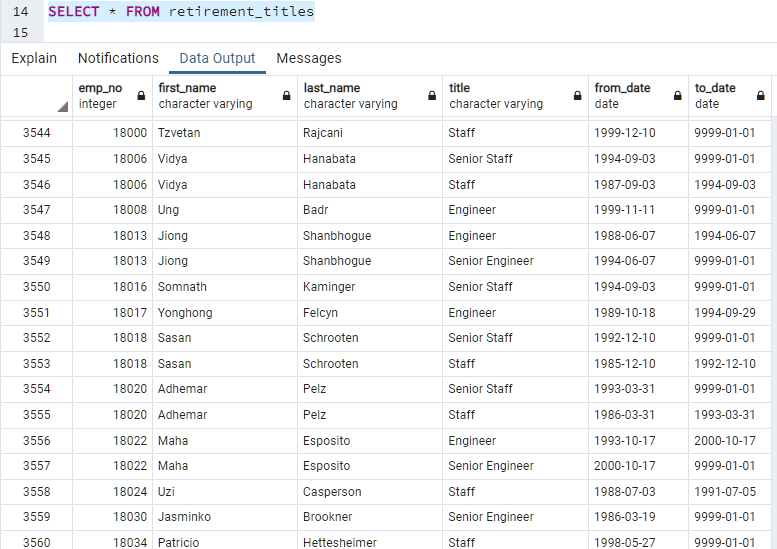
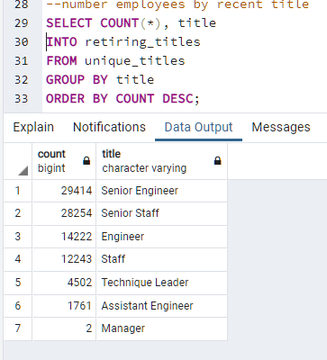
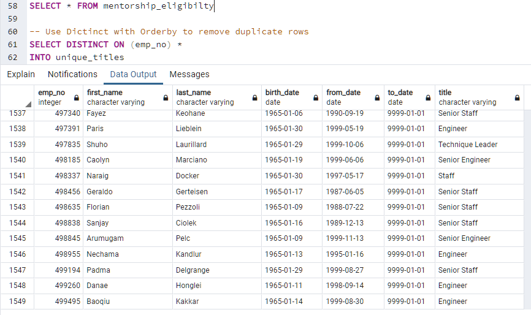

# Pewlett-Hackard-Analysis

###

Overview:

Pewlett-Hackard is a company of several thousand employees that is about experience a "silver tsunami." The "silver tsunami" refers to the large number of employees that are about to retire.  Data analyst are tasked with going through company database's to help prepare the company for the "silver tsunami."

#

Purpose:

The purpose of this analysis was to process the company's database to determine:
- the number of employees that will be retiring
- the titles held by those retiring
- which employees are eligible for the "retiering mentoring program"

#

Results:

- In the table below, we see the first set of results that show all employees with their corresponing titles. We can notice that some employees appear more than once in the table. This is due to the fact that some employees titles changed while working for the company.

   

    

- Duplicate employee entries were removed from the table above.  Only the most recent title of each employee was kept to further the analysis. 
  
- The the count of employees retiring per title was retrieved and is shown in the table below.
  
  

 - Employees with birthdates between January 1, 1965 and December 31, 1965 were retrieved to count the number of employees eligible for the mentorship program. A total of 1,549.

  
   

#
Summary:

The metrics used to prepare for Pewlett-Hackard's  "silver tsunami" were steps in the right direction. The needed count of employees retiring, as well as how many of those were eligible for the mentorship program were answered.  However, the amount of employees retiring is a staggering amount of over 90 thousand and further analysis must be performed to help implement a smooth transition for this event. The 

 for this eventhere are roles that need to be filled and more preparation in T and must t. 

The work in preparation can use more metrics 

#
Summary: Provide high-level responses to the following questions, then provide two additional queries or tables that may provide more insight into the upcoming "silver tsunami."
How many roles will need to be filled as the "silver tsunami" begins to make an impact?
Are there enough qualified, retirement-ready employees in the departments to mentor the next generation of Pewlett Hackard employees?
Deliverable 3 Requirements