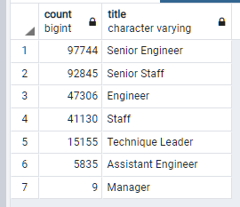
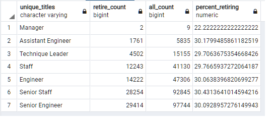

# Pewlett-Hackard-Analysis

###

Overview:

Pewlett-Hackard is a company of several thousand employees that is about to experience a "silver tsunami." The "silver tsunami" refers to the large number of employees that are about to retire.  Data analyst are tasked with creating an employee database to help prepare the company for the "silver tsunami."

#

Purpose:

The purpose of this analysis was to process the company's database to determine:
- the number of employees that will be retiring
- the titles held by those retiring
- which employees are eligible for the retiring mentoring program

#

Results:

- In the table below, we see the first set of results that show all employees with their corresponding titles. We can notice that some employees appear more than once in the table. This is due to employees changing titles while working for the company.

   

    

- Duplicate employee entries were removed from the table above.  Only the most recent title of each employee was kept to further the analysis. 
  
- The count of employees retiring per title was retrieved and is shown in the table below:
  
  

 - Employees with birthdates between January 1, 1965 and December 31, 1965 were retrieved, to determine the number of employees eligible for the mentorship program. A total of 1,549 are eligible.

  
   

#
Summary:

The metrics used to prepare for Pewlett-Hackard's "silver tsunami" resolved the following:

- The count of employees retiring by recent title
- The count of retiring eligible for the mentorship program 

However, the amount of employees retiring is a staggering amount of over 90 thousand and further analysis would help implement a smooth transition for the event of employees retiring. 
The proposed questions may be used to continue the following steps in this analysis: 

- How many roles will need to be filled?
- Are there enough qualified, retirement-ready employees in the departments to mentor the next generation of Pewlett Hackard employees?

Below are two provided tables from queries created to continue in resolving new concerns:

I. Total amount of employees per title at Pewlett-Hackard:

II. Percent of retiring employees per title:

In conclusion, there is about 30% percent of employees retiring per title. This data indicates more analysis is needed to be performed, for the amount of positions needed to be filled from those retiring, is a large sum. 